# Windows 365 Deployment Guide
## A Modern Approach to Desktop Virtualization

---

> ⚠️ **DISCLAIMER:** This is an unofficial community guide and is NOT an official Microsoft document. The information provided is for educational purposes only. Always refer to [official Microsoft documentation](https://learn.microsoft.com/windows-365/) for the most current and authoritative guidance.


**Version:** 1.0  
**Last Updated:** December 2024  
**Author:** Community Guide

---

## Table of Contents

1. [Executive Summary](#executive-summary)
2. [The Evolution of Desktop Delivery](#the-evolution-of-desktop-delivery)
3. [Historical Challenges](#historical-challenges-with-traditional-vdi)
4. [Why Windows 365?](#why-windows-365)
5. [Licensing Options](#licensing-options)
6. [Identity & Access Management](#identity--access-management)
7. [Network Architecture](#network-architecture)
8. [Image Management](#image-management)
9. [Update Management](#update-management)
10. [Application Delivery](#application-delivery)
11. [Data & Profile Management](#data--profile-management)
12. [Security Considerations](#security-considerations)
13. [Migration Roadmap](#migration-roadmap)
14. [Total Cost of Ownership](#total-cost-of-ownership)
15. [Success Stories](#success-stories)
16. [Next Steps](#next-steps)

---

## Executive Summary

Windows 365 represents a paradigm shift in how organizations deliver Windows desktops to their workforce. By streaming a full Windows experience from the Microsoft Cloud, organizations can provide secure, personalized Cloud PCs to any device, anywhere in the world.

### Key Benefits at a Glance

| Benefit | Impact |
|---------|--------|
| **Simplified Management** | 60-80% reduction in desktop management overhead |
| **Enhanced Security** | Zero Trust architecture with data never leaving the cloud |
| **Flexible Work** | Access your Cloud PC from any device, any location |
| **Predictable Costs** | Fixed per-user-per-month pricing model |
| **Instant Scalability** | Provision new desktops in minutes, not days |

---

## The Evolution of Desktop Delivery

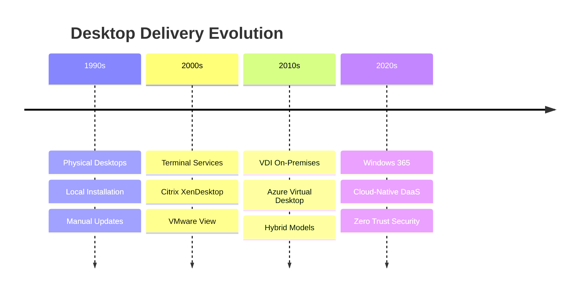

### The Journey to Modern Desktop

Organizations have continuously evolved their desktop delivery strategies:

**Phase 1: Physical Desktops (1990s-2000s)**
- Every user had a dedicated physical machine
- IT managed hardware lifecycle, patches, and software locally
- High capital expenditure, limited flexibility

**Phase 2: Server-Based Computing (2000s)**
- Terminal Services and Citrix introduced shared desktop sessions
- Reduced hardware costs but limited personalization
- Complex licensing and infrastructure requirements

**Phase 3: Virtual Desktop Infrastructure (2010s)**
- Full desktop virtualization with persistent/non-persistent options
- Significant infrastructure investment required
- Complex to deploy, manage, and scale

**Phase 4: Desktop as a Service (2020s)**
- Cloud-native, fully managed desktop experience
- No infrastructure to manage
- Predictable costs, instant scalability

---

## Historical Challenges with Traditional VDI

### Infrastructure Complexity

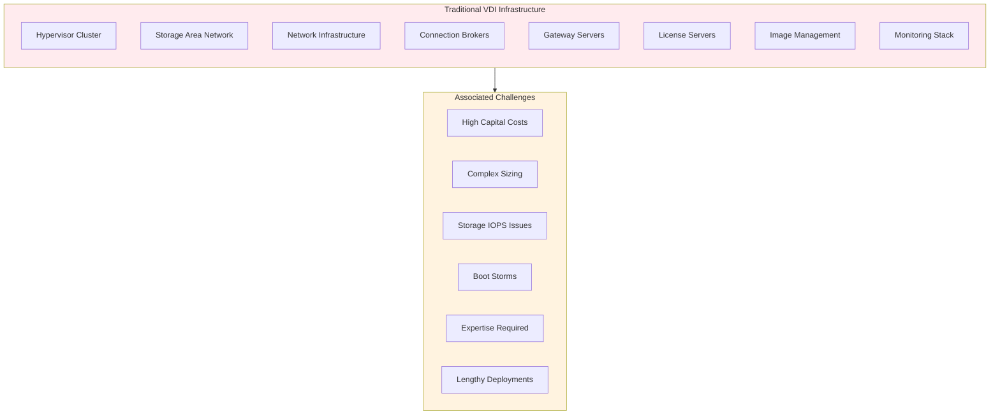

### Common Pain Points

#### 1. **Capacity Planning Nightmares**
Traditional VDI required precise capacity planning months in advance:
- CPU, memory, and storage calculations
- IOPS requirements for boot and login storms
- Network bandwidth for protocols and data
- **Result:** Over-provisioning (waste) or under-provisioning (poor performance)

#### 2. **Storage Performance Issues**
> *"We spent more time troubleshooting storage IOPS issues than any other VDI problem."*
> — IT Director, Fortune 500 Company

- Boot storms overwhelming shared storage
- Anti-virus scan storms
- Windows Update storms
- Profile loading latency

#### 3. **Complexity and Expertise**
| Component | Skills Required |
|-----------|----------------|
| Hypervisor | VMware/Hyper-V administration |
| Storage | SAN/NAS configuration, tiering |
| Networking | VLAN, firewall, load balancing |
| VDI Platform | Citrix/VMware/Microsoft expertise |
| Security | Endpoint, network, identity |
| Monitoring | Performance, capacity, user experience |

#### 4. **User Experience Challenges**
- Latency in remote locations
- Graphics-intensive application performance
- Peripheral device compatibility
- Offline access limitations

#### 5. **Cost Unpredictability**
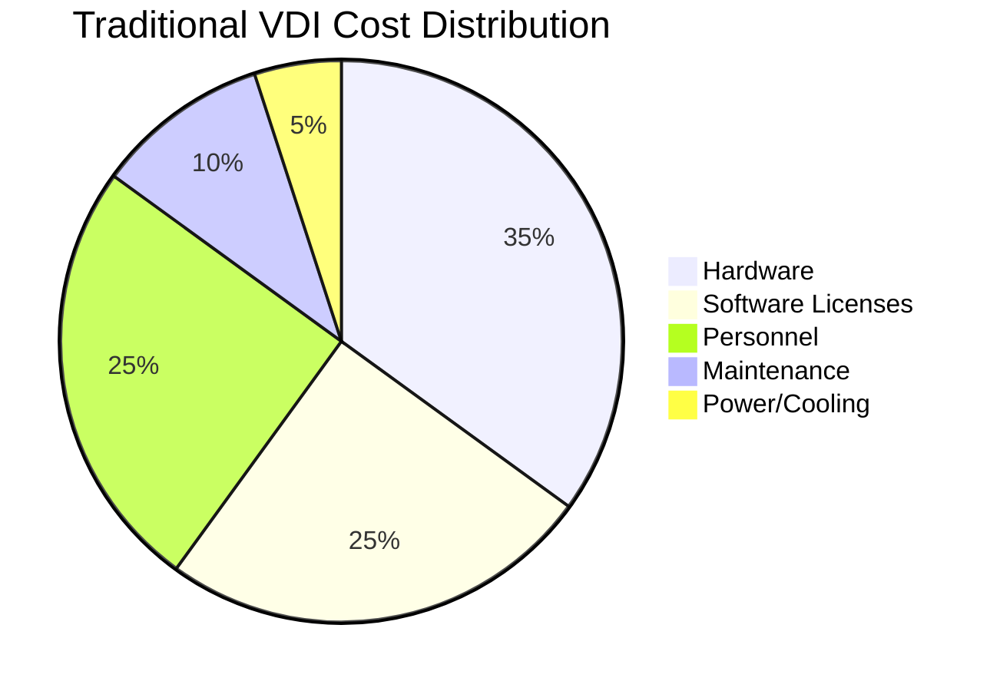

---

## Why Windows 365?

### The Cloud PC Difference

Windows 365 eliminates the complexity of traditional VDI by providing a fully managed Desktop as a Service solution.

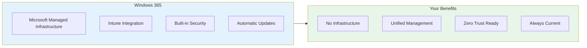

### Key Differentiators

| Feature | Traditional VDI | Windows 365 |
|---------|----------------|-------------|
| **Infrastructure** | Customer managed | Microsoft managed |
| **Deployment Time** | Weeks to months | Minutes |
| **Scaling** | Hardware procurement | Click to provision |
| **Updates** | Manual orchestration | Automatic |
| **Pricing** | Variable, complex | Fixed per-user |
| **Expertise Required** | Extensive | Minimal |
| **Offline Access** | Limited/None | Windows 365 Offline |

### Windows 365 Architecture

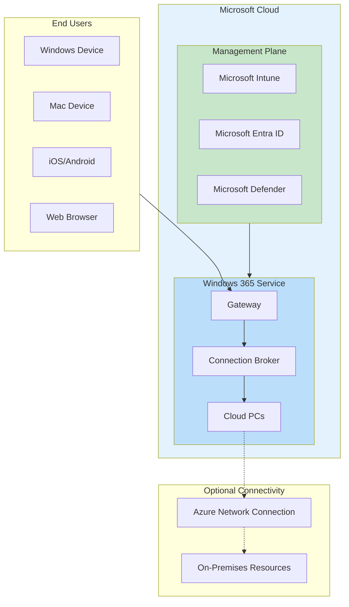

---

## Licensing Options

### Windows 365 Enterprise

**Best for:** Organizations with Microsoft 365 E3/E5 or Windows E3/E5 licensing and Intune

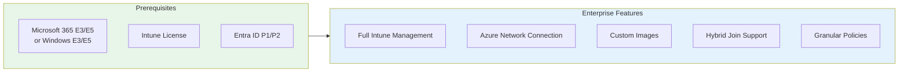

**SKU Options:**

| Configuration | vCPU | RAM | Storage | Best For |
|--------------|------|-----|---------|----------|
| Basic | 2 | 4 GB | 64 GB | Light users, task workers |
| Standard | 2 | 8 GB | 128 GB | Knowledge workers |
| Premium | 4 | 16 GB | 128 GB | Power users |
| Advanced | 8 | 32 GB | 512 GB | Developers, data analysts |

### Windows 365 Business

**Best for:** Small to medium businesses without Intune infrastructure

| Feature | Business | Enterprise |
|---------|----------|------------|
| Max Users | 300 | Unlimited |
| Intune Required | No | Yes |
| Azure Network Connection | No | Yes |
| Custom Images | No | Yes |
| Hybrid Join | No | Yes |
| Self-Service Portal | Yes | Via Intune |

### Windows 365 Frontline

**Best for:** Shift workers, retail, manufacturing

- **3:1 licensing ratio** — One license supports up to 3 shift workers
- Ideal for non-concurrent usage patterns
- Same Cloud PC experience with significant cost savings

### Windows 365 Link

**Purpose-built thin client device** for Windows 365:
- Secure, dedicated hardware
- Zero local data storage
- Instant boot to Cloud PC
- Microsoft managed firmware

---

## Identity & Access Management

### Identity Configuration Options

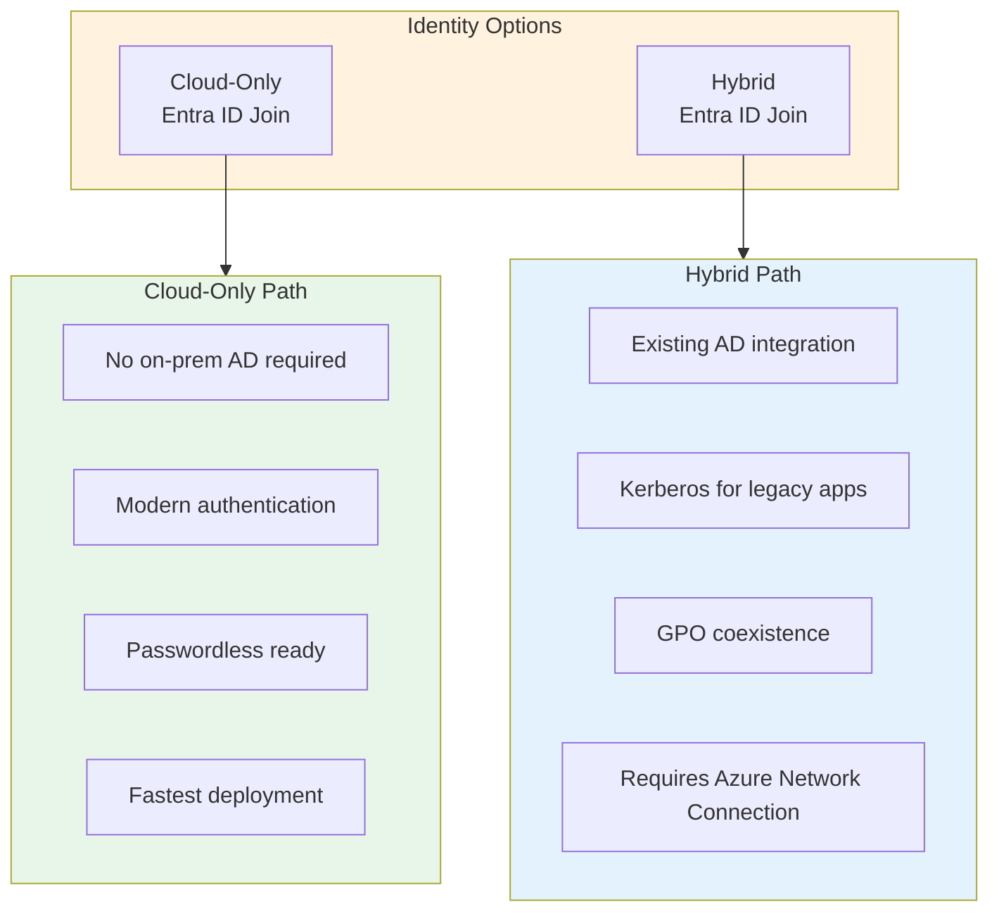

### Recommendation Matrix

| Scenario | Recommended Identity | Rationale |
|----------|---------------------|-----------|
| New organization / Greenfield | Entra ID Join | Simplest, most modern approach |
| Heavy legacy app dependency | Hybrid Entra ID Join | Kerberos authentication required |
| Regulatory compliance (on-prem) | Hybrid Entra ID Join | Data residency requirements |
| Remote-first workforce | Entra ID Join | No VPN dependency |
| Existing GPO investment | Hybrid (transitional) | Gradual migration to Intune |

### Authentication Best Practices

1. **Enable Multi-Factor Authentication (MFA)**
   - Required for all Cloud PC access
   - Use Microsoft Authenticator app
   - Consider FIDO2 security keys for high-security users

2. **Implement Conditional Access**
   ```
   Policy Example: Cloud PC Access
   ├── Users: All Cloud PC users
   ├── Cloud apps: Windows 365
   ├── Conditions:
   │   ├── Sign-in risk: Medium or High → Block
   │   └── Device platforms: Any
   └── Grant: Require MFA + Compliant device
   ```

3. **Enable Single Sign-On (SSO)**
   - Seamless authentication to Cloud PC
   - Reduces password prompts
   - Requires Entra ID P1 or higher

---

## Network Architecture

### Network Configuration Options

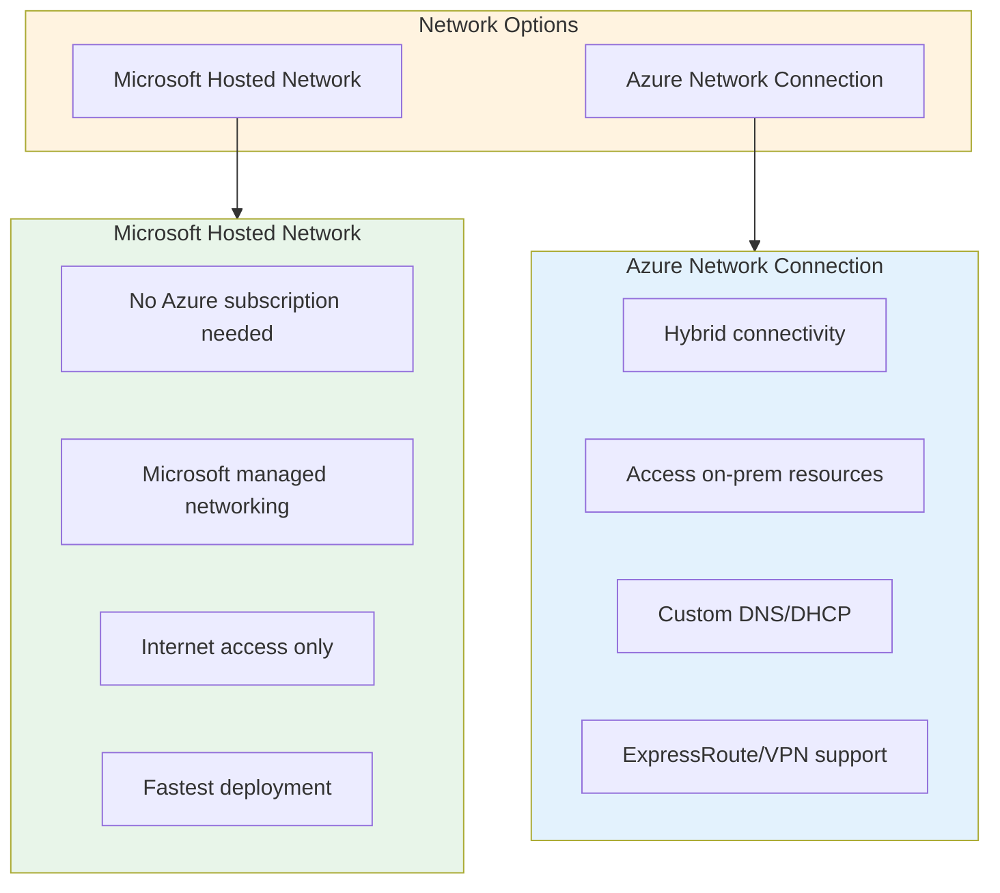

### Decision Framework

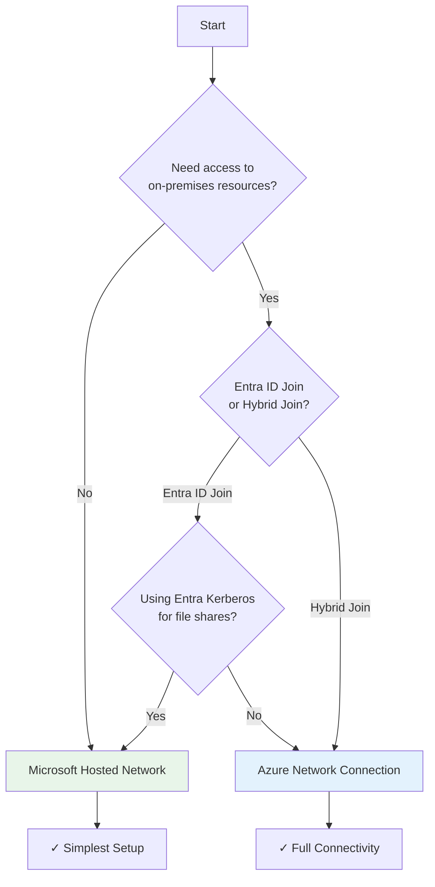

### Azure Network Connection Architecture

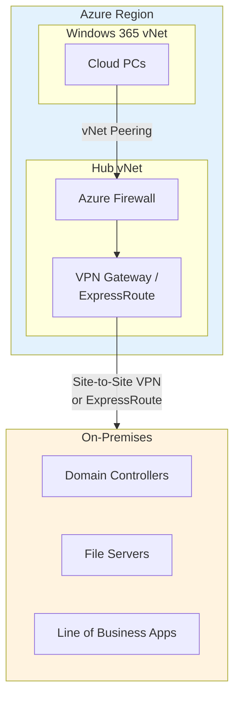

### Network Requirements

| Requirement | Details |
|------------|---------|
| **Bandwidth** | Minimum 1.5 Mbps per user (recommended 5+ Mbps) |
| **Latency** | <100ms round-trip time to Azure region |
| **Ports** | TCP 443 (HTTPS), UDP 3478 (RDP Shortpath) |
| **Endpoints** | [Windows 365 Network Requirements](https://learn.microsoft.com/windows-365/enterprise/requirements-network) |

---

## Image Management

### Image Strategy Options

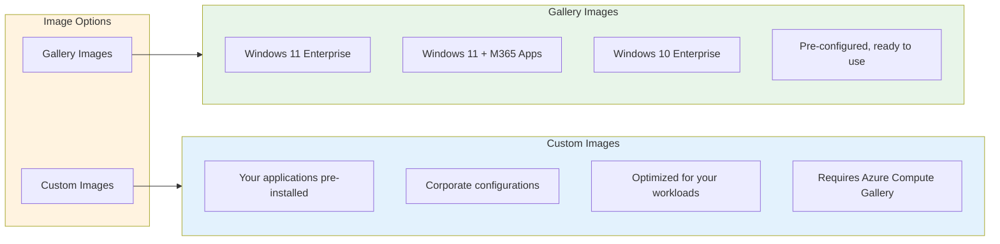

### Custom Image Best Practices

1. **Start with Gallery Image**
   - Begin with Microsoft's optimized base
   - Add applications via layering
   
2. **Optimize Before Capture**
   - Run Windows Update
   - Install required applications
   - Apply security baselines
   - Run Sysprep (generalize)

3. **Image Lifecycle Management**
   ```
   Image Lifecycle
   ├── Development (Create/Test)
   ├── Staging (Pilot validation)
   ├── Production (General availability)
   └── Retirement (Archive/Delete)
   ```

4. **Version Control**
   - Use naming conventions: `W365-Win11-v1.2.0`
   - Document changes in image notes
   - Maintain rollback capability

---

## Update Management

### Windows Update for Business Integration

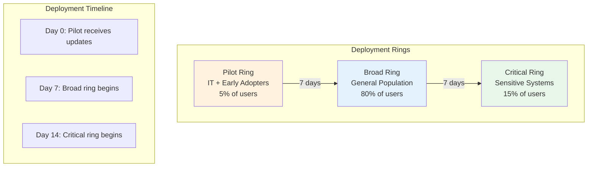

### Update Strategy Recommendations

| Update Type | Deferral Period | Ring Strategy |
|------------|-----------------|---------------|
| Quality Updates (Security) | 0-7 days | Pilot → Broad → Critical |
| Feature Updates | 30-90 days | Extended testing recommended |
| Driver Updates | 7-14 days | Test with hardware profiles |
| Microsoft 365 Apps | Current Channel or Monthly Enterprise | Align with Windows rings |

### Autopatch Integration

Windows Autopatch provides fully managed update experience:
- Microsoft manages update deployment
- Automatic ring progression
- Built-in rollback capabilities
- Service health monitoring

---

## Application Delivery

### Application Deployment Methods

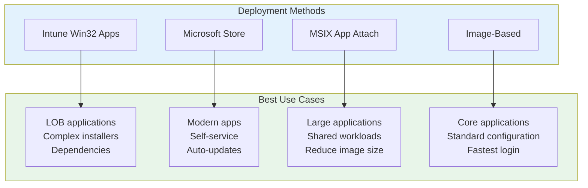

### Application Strategy Matrix

| Application Type | Recommended Method | Notes |
|-----------------|-------------------|-------|
| Microsoft 365 Apps | Gallery Image or Intune | Use Microsoft CDN |
| Line of Business | Intune Win32 | Include dependencies |
| Large Applications (>1GB) | Custom Image | Avoid login delays |
| Frequently Updated | Microsoft Store | Auto-update capability |
| Legacy Applications | Intune Win32 + Scripts | May need compatibility shims |

### Modern App Management Benefits

1. **Self-Service Company Portal**
   - Users install approved apps on-demand
   - Reduces IT ticket volume
   - Maintains compliance

2. **Required vs Available Apps**
   ```
   App Deployment
   ├── Required: Auto-install for all users
   │   └── Microsoft 365, Security tools, VPN
   └── Available: User-initiated install
       └── Productivity tools, utilities
   ```

3. **Application Protection Policies**
   - Prevent data leakage
   - Enforce encryption
   - Selective wipe capability

---

## Data & Profile Management

### Profile Strategy Options

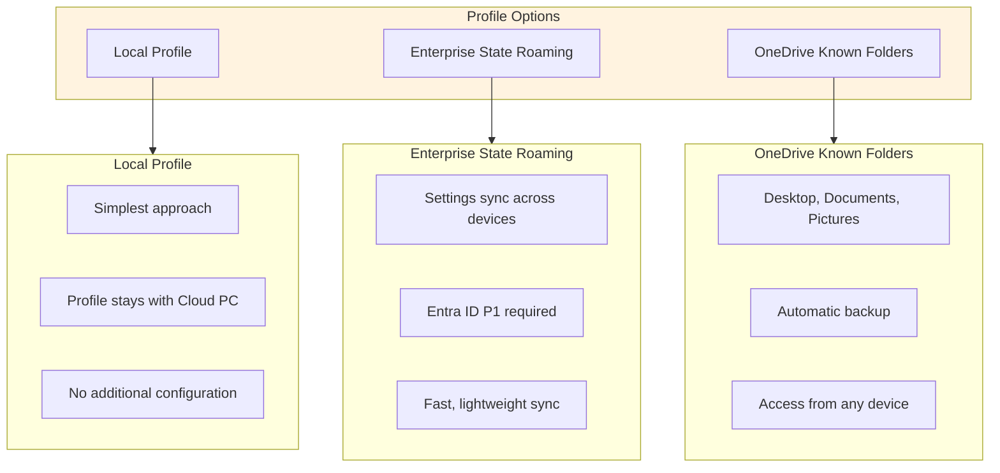

### Data Protection Architecture

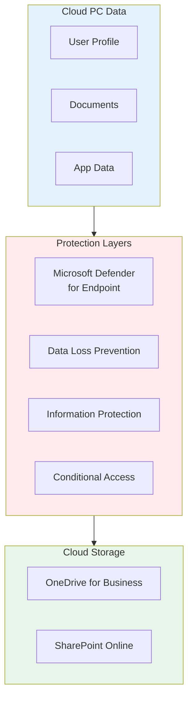

### Recommendations

| Scenario | Profile Strategy | Data Strategy |
|----------|-----------------|---------------|
| Knowledge Workers | Local + ESR | OneDrive KFM |
| Developers | Local (large profile) | OneDrive + Azure DevOps |
| Frontline/Shared | Local only | OneDrive selective sync |
| Highly Mobile | ESR required | Full OneDrive sync |

---

## Security Considerations

### Zero Trust Architecture with Windows 365

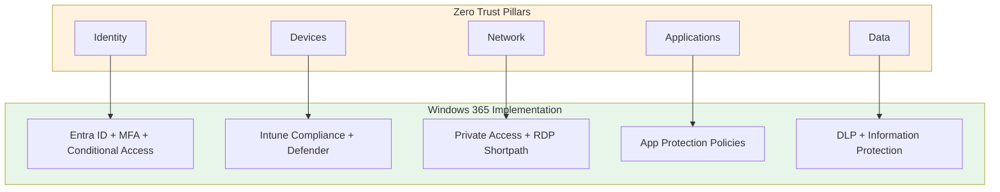

### Security Features

| Feature | Description | License Required |
|---------|-------------|------------------|
| **Microsoft Defender for Endpoint** | Advanced threat protection | M365 E5 or Defender P2 |
| **Conditional Access** | Risk-based access control | Entra ID P1 |
| **Compliance Policies** | Device health requirements | Intune |
| **BitLocker Encryption** | Disk encryption | Built-in |
| **Windows Firewall** | Network protection | Built-in |
| **Attack Surface Reduction** | Exploit protection | Defender |

### Security Baseline Checklist

- [ ] Enable MFA for all users
- [ ] Configure Conditional Access policies
- [ ] Deploy Microsoft Defender for Endpoint
- [ ] Enable disk encryption (BitLocker)
- [ ] Configure compliance policies
- [ ] Enable audit logging
- [ ] Implement DLP policies
- [ ] Configure session timeouts
- [ ] Enable screen capture protection (where needed)
- [ ] Regular security assessments

---

## Migration Roadmap

### Phased Approach

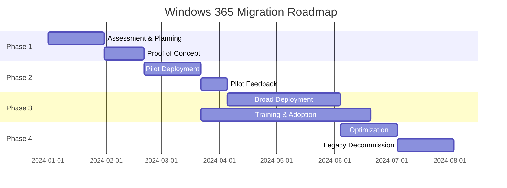

### Phase Details

#### Phase 1: Assessment & Planning (4-6 weeks)

**Objectives:**
- Inventory current desktop environment
- Identify user personas and requirements
- Define success criteria
- Establish governance model

**Key Activities:**
| Activity | Stakeholders | Deliverable |
|----------|--------------|-------------|
| User Assessment | IT, HR, Business | User persona mapping |
| Application Inventory | IT, App Owners | App compatibility report |
| Network Assessment | Network Team | Bandwidth/latency report |
| Security Review | Security Team | Security requirements doc |
| Cost Analysis | Finance, IT | TCO comparison |

#### Phase 2: Proof of Concept (3-4 weeks)

**Objectives:**
- Validate technical architecture
- Test critical applications
- Measure user experience
- Identify gaps

**POC Scope:**
- 10-25 users across different personas
- Core business applications
- Multiple geographic locations
- Various access scenarios (office, home, mobile)

#### Phase 3: Pilot Deployment (6-8 weeks)

**Objectives:**
- Scale to larger user group (5-10%)
- Refine deployment processes
- Build support documentation
- Train help desk

**Success Metrics:**
| Metric | Target |
|--------|--------|
| User Satisfaction | >80% positive |
| Help Desk Tickets | <5% of users/week |
| Application Compatibility | >95% working |
| Performance (latency) | <100ms |

#### Phase 4: Broad Deployment (8-12 weeks)

**Objectives:**
- Full production rollout
- Change management execution
- Continuous improvement

**Deployment Waves:**
```
Wave 1: Early Adopters (Week 1-2)
├── IT Department
├── Champions network
└── 100-200 users

Wave 2: Business Units (Week 3-6)
├── Department by department
├── 500-1000 users per wave
└── Support resources allocated

Wave 3: Remaining Users (Week 7-12)
├── Final migrations
├── Legacy system decommission
└── Project closure
```

---

## Total Cost of Ownership

### Cost Comparison Framework

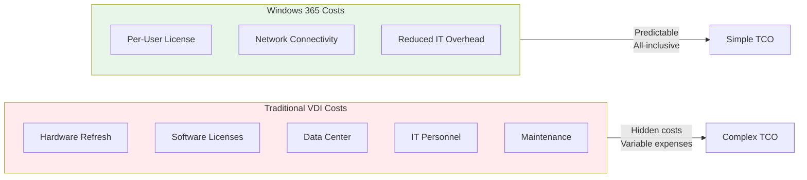

### Sample TCO Analysis (500 Users, 3 Years)

| Cost Category | Traditional VDI | Windows 365 |
|---------------|----------------|-------------|
| Infrastructure (Hardware) | $400,000 | $0 |
| VDI Software Licenses | $150,000 | $0 |
| Windows 365 Licenses | $0 | $540,000* |
| Azure Infrastructure | $0 | $36,000** |
| IT Personnel (Management) | $300,000 | $150,000 |
| Training & Support | $50,000 | $30,000 |
| Power & Cooling | $45,000 | $0 |
| **Total 3-Year Cost** | **$945,000** | **$756,000** |
| **Per User Per Month** | **$52.50** | **$42.00** |

*Based on Windows 365 Enterprise 4vCPU/16GB configuration at $60/user/month  
**Azure Network Connection and related services

### ROI Drivers

1. **Reduced Capital Expenditure**
   - No hardware refresh cycles
   - No data center expansion

2. **Operational Efficiency**
   - 60-80% reduction in desktop management time
   - Automated provisioning and updates
   - Simplified troubleshooting

3. **Business Agility**
   - Rapid scaling for projects/M&A
   - Support for flexible work
   - Faster onboarding

4. **Security & Compliance**
   - Reduced breach risk
   - Built-in compliance controls
   - Simplified auditing

---

## Success Stories

### Financial Services Company

> **Challenge:** Support 5,000 remote advisors with secure access to client data
> 
> **Solution:** Windows 365 Enterprise with Conditional Access and DLP
> 
> **Results:**
> - 99.9% uptime achieved
> - 40% reduction in security incidents
> - 3x faster advisor onboarding
> - $2M annual savings vs. previous VDI solution

### Healthcare Organization

> **Challenge:** Enable HIPAA-compliant remote access for clinical staff
> 
> **Solution:** Windows 365 Enterprise with Azure Network Connection
> 
> **Results:**
> - Full HIPAA compliance maintained
> - Clinicians access EMR from any location
> - 50% reduction in IT support tickets
> - Enabled telehealth expansion during pandemic

### Manufacturing Company

> **Challenge:** Provide consistent desktop experience for 3,000 shift workers across 12 plants
> 
> **Solution:** Windows 365 Frontline with shared licensing
> 
> **Results:**
> - 65% cost reduction vs. dedicated licenses
> - Standardized environment across all locations
> - Eliminated plant-specific IT infrastructure
> - 2-hour new worker onboarding (vs. 2 days)

---

## Next Steps

### Recommended Actions

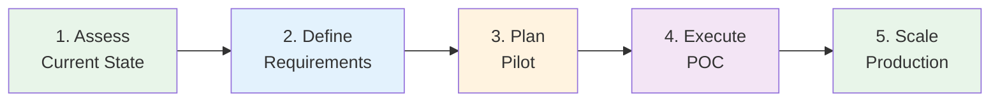

### Engagement Options

| Engagement | Duration | Outcome |
|------------|----------|---------|
| **Discovery Workshop** | 1 day | Requirements document, initial architecture |
| **Proof of Concept** | 2-4 weeks | Working pilot environment, validated approach |
| **Deployment Services** | 8-16 weeks | Production deployment, knowledge transfer |
| **Managed Services** | Ongoing | Continuous management and optimization |

### Resources

- [Windows 365 Documentation](https://learn.microsoft.com/windows-365/)
- [Windows 365 Technical Community](https://techcommunity.microsoft.com/t5/windows-365/bd-p/Windows365)
- [Microsoft Adoption Hub](https://adoption.microsoft.com/)
- [Windows 365 Pricing](https://www.microsoft.com/windows-365/business/compare-plans-pricing)

---

## Appendix A: Pre-Deployment Checklist

### Licensing
- [ ] Microsoft 365 E3/E5 or Windows E3/E5 licenses available
- [ ] Intune licenses assigned
- [ ] Entra ID P1/P2 for Conditional Access
- [ ] Windows 365 license SKUs selected

### Identity
- [ ] Entra ID tenant configured
- [ ] User accounts synced (if hybrid)
- [ ] MFA enabled and tested
- [ ] Conditional Access policies defined

### Network
- [ ] Network configuration determined (MHN vs ANC)
- [ ] Required endpoints whitelisted
- [ ] Bandwidth assessment completed
- [ ] RDP Shortpath evaluated

### Applications
- [ ] Application inventory completed
- [ ] Compatibility testing done
- [ ] Deployment method determined for each app
- [ ] Custom image requirements defined

### Security
- [ ] Security baseline defined
- [ ] Compliance policies created
- [ ] Defender for Endpoint configured
- [ ] DLP policies planned

### Operations
- [ ] Support processes documented
- [ ] Monitoring configured
- [ ] Backup/recovery procedures defined
- [ ] Training materials prepared

---

## Appendix B: Glossary

| Term | Definition |
|------|------------|
| **Cloud PC** | A Windows virtual machine hosted by Microsoft and streamed to users |
| **Azure Network Connection (ANC)** | Connects Windows 365 to your Azure virtual network |
| **Microsoft Hosted Network (MHN)** | Microsoft-managed networking with internet access only |
| **Entra ID** | Microsoft's cloud identity and access management service |
| **Intune** | Microsoft's cloud endpoint management platform |
| **Provisioning Policy** | Configuration defining how Cloud PCs are created |
| **Gallery Image** | Pre-built Windows images provided by Microsoft |
| **RDP Shortpath** | Direct UDP connection for improved performance |
| **Conditional Access** | Policy-based access control in Entra ID |
| **Windows Autopatch** | Microsoft-managed Windows update service |

---

---

## Disclaimer

*This is an **unofficial community guide** and is not affiliated with, endorsed by, or representative of Microsoft Corporation. The information contained in this document is provided "as-is" for educational and informational purposes only.*

*Product names, logos, and brands are property of their respective owners. Always refer to official Microsoft documentation and consult with qualified professionals before making deployment decisions.*

*For official guidance, please visit: [Microsoft Learn - Windows 365](https://learn.microsoft.com/windows-365/)*
